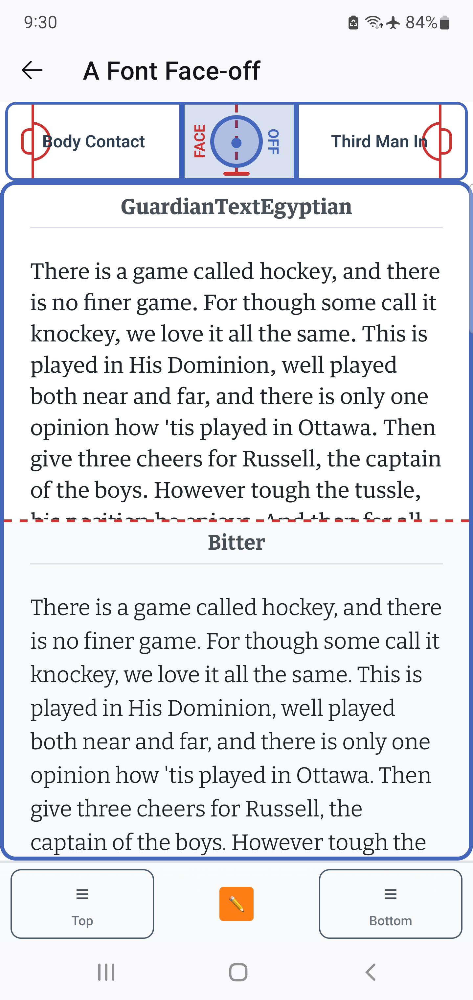
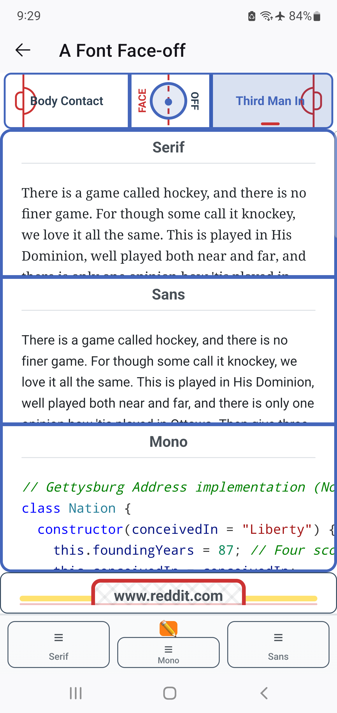
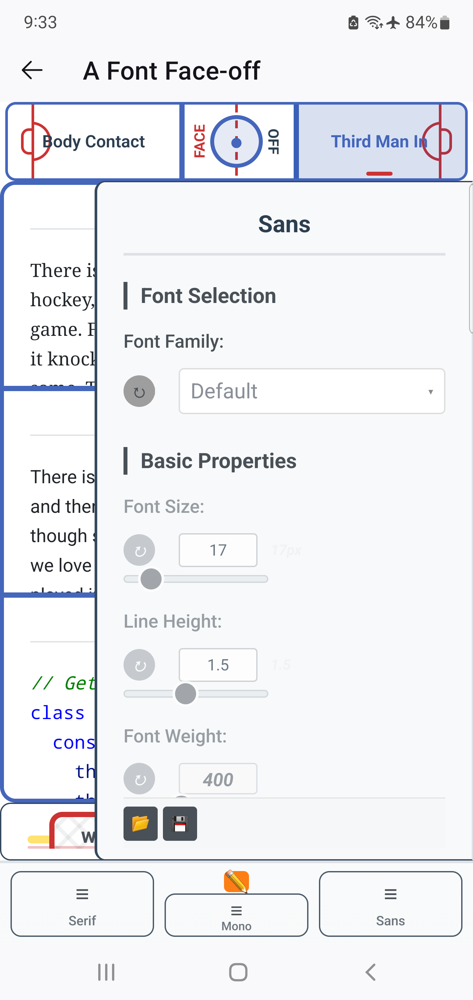

  

# A Font Face-off

**A Firefox Android extension that replaces font families and sizes on Firefox web pages. Can also compare how 2 different ones look on your Android device before deciding to apply.**

  
  
  

Pick any Google Font at runtime, tune variable axes (weight, width, optical size, and more), and see how they actually render on real content. Just change the size if they're too small. No rebuilds, no font files bundled — everything loads on the fly. Even pick decimal size fonts to get the Goldilocks size.

I created this extension because looking at the Spectral font on my Android tablet on long articles made my eyes bleed.

## Three Ways to Use It

- **Body Contact** — Swap the reading font on any page.
- **Face-off** — Compare two fonts side-by-side in the popup. Pure comparison, no page changes.
- **Third Man In** — Three panels for Serif, Sans, and Mono. Each targets its font family type on the page independently.

## What Makes It Fun

- Full Google Fonts library at your fingertips via search + A-Z rail
- Variable axes sliders auto-generated from Google Fonts metadata. Go nuts on the Roboto Flex and Recursive fonts' multiple axes!
- Save favorites per panel, drag to reorder, load them back instantly
- Efficient CSS injection handles (mostly) everything — can adapt to aggressive style-clearing sites
- Add your own font-face css at-rules in the options UI. Can even be a variable font!
- No advertising SDKs or third-party analytics trackers — all code is open source

## Less Obvious Features

- **Built-in SIL fonts** — Andika (sans), Charis (serif), and Gentium (serif) are bundled as full non-subsetted fonts from [SIL International](https://software.sil.org/). Google Fonts serves broken subsets of these that can't render IPA tone letters and combining diacritical marks correctly.
  - Just want a simple Violentmonkey/Tampermonkey user.js for the SIL fonts and don't want the full extension? There's one in userscripts/.
- **Quick Pick** — Press the top-most button in the left toolbar (hockey stick and mask icon) to open a favorites panel directly on the page. Apply saved fonts without opening the popup.
- **Wait For It** — Long-press the WhatFont button to delay font detection until the page finishes loading dynamic content. Configure per-domain in quick pick or options.
- **Substack Roulette** — Randomly applies a different favorite font each time you visit a Substack page. Configure which favorites participate in options.
- **Cloud sync** — Sync domain settings, favorites, and custom fonts CSS via Google Drive or WebDAV.
- **Page Up/Down & Close Tab** — Toolbar buttons to scroll up or down by one viewport height (configurable overlap, long-press for alternate overlap), plus a close-tab button.

## Install

Firefox Android only. Download and install the signed `.xpi` from https://github.com/defmikekoh/a-font-face-off/releases/tag/android-test-latest .

## Privacy

This extension can process browsing activity (current tab URL/origin) to apply per-site font settings and support optional cloud sync features.

- Not sold to data brokers
- Not used for advertising
- Not used for creditworthiness, lending, housing, insurance, education admissions, criminal justice, employment, or healthcare decisions
- Optional sync backends (Google Drive or WebDAV) only transmit extension settings/configuration data needed for sync

See [PRIVACY.md](PRIVACY.md) for details.

## Acknowledgments

Built on the shoulders of:

- [Fontonic](https://github.com/amkhrjee/fontonic-firefox-android) by @amkhrjee — the main inspiration for this project
- [WhatFont Bookmarklet](https://github.com/chengyin/WhatFont-Bookmarklet) by @chengyin — packaged for font detection
- [Essential Buttons Toolbar](https://github.com/KristhianX/essential-buttons-toolbar) by @KristhianX — toolbar and options page UI

## License

MIT License - see [LICENSE](LICENSE) file for details.
